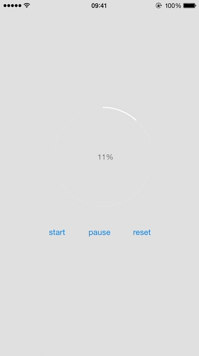

ProgressBarView
===============

## Preview



## Usage

### Installation

copy `ProgressBarView.h`, `ProgressBarView.m` into your project.


Add the following import to the top of the file:

```objc
#import "ProgressBarView.h"
```

### Configuration

```objc
self.progressBarView = [[ProgressBarView alloc]initWithFrame:CGRectMake(100, 200, self.view.frame.size.width / 2, self.view.frame.size.width / 2)];
[self.progressBarView setBackgroundColor:[UIColor clearColor]];
self.progressBarView.delegate = self;
self.progressBarView.progressBarColor = [UIColor whiteColor];
self.progressBarView.progressBarShadowOpacity = .1f;
self.progressBarView.progressBarArcWidth = 2.0f;
self.progressBarView.wrapperColor = [UIColor colorWithRed: 240.0 / 255.0 green:240.0 / 255.0 blue: 240.0 / 255.0 alpha: .5];
self.progressBarView.duration = 1.0f;
```

## License

The MIT License (MIT)

Copyright (c) 2015 xdf
